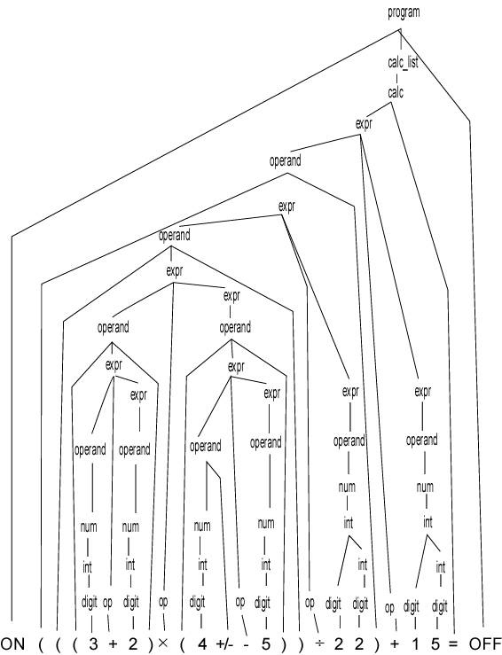

# Writing a first interpreter in Golang in III Parts

Hi everyone! Last time, I've introduced [the **PizzaScript** project](https://korzio.medium.com/introducing-pizzascript-educational-go-open-source-project-d7a15128db94) — Educational Go Open Source Project. 

We continue with this article and a meetup to happen [13 February, 10:00 CET](https://youtu.be/V6naUYo1Wdk). In that material we overview the project and introduce key concepts for creating a new programming language. We will show the simple calculator's implementation using `Golang` and `RxGo`. This article focuses on `lexer` scenario with `ReactiveX`, leaving `parser` and `eval` for the next time. This series can help beginners in learning `Golang` and `WebAssembly`, and experiment with a live open source project.

## I Part 

> Which introduces PizzaScript programming language, aka 

> Programming language that fucks up (c)

`PizzaScript` or `ps` is a new cool programming language with no-ordinary paradigm. 

Why? I love `JavaScript` 💛 and `TypeScript` 💙. I especially enjoy [`JavaScript` quirks](https://github.com/denysdovhan/wtfjs), and always wanted even more freedom than the `JavaScript` language gives. And I didn't try to build my own programming language yet. I decided to build one, and my goals are:

- Understand how programming languages & interpreters work
- Learn `Go` language, and key libraries like `RxGo`
- Experiment with `WebAssembly`

[wat](https://www.destroyallsoftware.com/talks/wat)

### Key Features 

- Cool name (and logo)!

That's maybe the most important of all features. We are proud of our choice.

- `JavaScript` like syntax, kind of
- Variables, integers, floats and strings
- Arithmetic expressions, built-in functions
- Functions, first class functions, closures
- Dynamic types and coercions
- Modules & Standard library
- Awesome ideas and interpreter flows

```ps
var h1679 = "1"
val g2788 = 2

h1679 + g2788 == "12"
g2788 + h1679 == 3
```

- `PizzaScript` compiles to `WebAssembly`, which makes it portable and suitable target for execution both on client and server sides.

Ok than, sounds challenging. How we are going to build it?
- I’m interested in learning `Golang` language myself. 
- I wanted to try docomposing a project in `reactive` way. Also, learning a library can help with new programming language. [RxGo](https://github.com/ReactiveX/RxGo) will help to organize data flow - split input text into tokens, then parse and organize into [abstract-syntax tree](wiki) 

[embed] abstract-syntax-tree https://en.wikipedia.org/wiki/Abstract_syntax_tree

- `WebAssembly` is a big thing, and we are going to produce modules in `wasm` or `wat` formats.

Beside, 
It's cool to build a programming language and a compiler anyways

## II Part - Programming languages

A programming language is a piece of art if you ask me 😀. Seriously, it's enormous work - to understand, build, and support one. Personally, my first picture of a programming language are code samples written in it.
Like with `PizzaScript`, this small example shows a function definition

```ps
fun sum(var a1573: string, b7232): int {
  a1573 + b7232
}

sum(1, 2) // 12
```

As you can see, functions are declared with the `fun` keyword. 

> Well, it's not really fun 🤔

So, what is a programming language? It certainly needs a few definitions here:
- We have an `alphabet` of all available symbols. A text written in it is essentially a chain of characters from the alphabet.
- And than we have a specific set of chains from the `alphabet`. Those form a `language`. 

Than a question - how can we specify the language? And there are of course different ways to do that. The simplest is to list all the chains in it. As one can imagine, most programming languages consists of infinite number of chains. 

> I mean, I can hardly imagine that someone has written two identical programms in `PizzaScript`

We need another way, and that usually is a schematic representation, implying an algorithm to deduce all potential chains.

It can be 
- a programm that validates if given text is of a particular language, - or a program that generates possible chains from the language

- `Grammars` are rules defining a language, a written in a special form algorithm.

The most known is [the `Backus–Naur` form](https://en.wikipedia.org/wiki/Backus%E2%80%93Naur_form)

```
<personal-part> ::= <initial> "." | <first-name>
```

Read like every `personal-part` is an `initial` with `dot` or `first-name` types of symbols' sequences, separated with "|". Below you can see a simple calculator language shaped in BNF.

```
expr ::= operand {('+' | '-' | '*' | '/') operand} ; any number of infix operations
; with no precedence
operand ::= num [+/-] | '(' expr ')' ; a number followed optionally by
; +/- or a parenthsized expression
num ::= digit {digit} ['.' {digit}]] ; numbers can be integer or real
digit ::= '0 | '1' | '2' | '3' | '4' | '5' | '6' | '7' | '8' | '9'
```



> A popular [tool parser generator `antlr`](https://github.com/antlr/grammars-v4/blob/master/calculator/calculator.g4) provides an extended version of the calculator's grammar.

Generally speaking, this grammars can be translated into software programms. And the programm that we are going to build is a compiler.

> So, how programming language's compilers works? 

Many studies are dedicated to this topic, and we just briefly embrace main ideas. Usually, compiler programm consists of a sequential but independent stages. Each one has it's own purpose. 

- **Lexical analysis** is responsible for splitting input text into subsequences of lexems. It filters separators (like spaces ` ` or `;`) and transforms meaninful symbols into typed objects named tokens. Tokens are of different types, such as data types - **numbers, strings**, variables definitions - **identifiers**, operators - **+, -, =, /**, etc.

- **Syntactic analysis** or **parser** works with a set of lexems, parsed from the first stage. It has two goals - check if a program is valid against the syntax and to produce declarative representation for further processing.

An output of this stage is an abstract syntax tree. It is a data object, representing programm's text as a declarative tree structure. Each node in the tree denotes language's construct happening in the original program.

The *ast* format doesn't have a unique standard across different languages. For instance, babel - a popular `JavaScript` *transpiler* (another interesting term commonly used in *compilers* context) which converts different `EcmaScript` versions into each other, [has it's own defined specification](https://github.com/babel/babel/blob/main/packages/babel-parser/ast/spec.md)

This is an example of node types defined in `babel ast` format.

```js
interface Node {
  type: string;
  loc: SourceLocation | null;
}

interface NumericLiteral <: Literal {
  type: "NumericLiteral";
  value: number;
}
```

> [The AST Explorer](https://astexplorer.net/) allows to see how different languages can be represented in different `ast` formats

- And there are different scenarios what happens after programm is parsed. For example, it may be compiled into target instructions, evaluated or interpreted.

The `PizzaScript`'s compilation target is the `WebAssembly`, meaning we will produce an output in `wasm` or `wat` format. Our goal is to make a portable programming language.

## III Part - Reactive Patterns

For now we discussed stages of programm text processing, which are:
- to split text into tokens or to perform lexical analysis,
- to parse lexems or syntactic analysis,
- to build abstract syntax tree,
- to compile or evaluate parsed tree.

This phases can work independently and produce output for each step. Otherwise, data can flow between phases in unidirectional way. The parser can request a new token from the lexer, or the lexer can produce a token once it is identified.

One of the ideas I always pursued, was to *decompose an application into Reactive patterns*. In this paradigm, all data is represented as a stream of asyncronous events. And `ReactiveX` project nicely unifies related patterns such as `Observable, Iterator, Functional Programming`. It allows to use API implementing main actors and operators to combine, transform, and split streams.

We have chosen `Golang`, and will use the [`RxGo`](https://github.com/ReactiveX/RxGo) implementation of `ReactiveX`. It has sufficient support for it's concepts and operators.

We start with the calculator use case, and what we are going to create are:

- `main` - a main package to run, 
- `repl` - reads user's input, initializes all needed actors and produces output, 
- `token` - declares `PizzaScript`'s allowed symbols and operators,
- `lexer` - splits input text into tokens,
- `parser` - generates programm's abstract-syntax tree,
- `ast` - describes `ast` types,
- `eval` - evaluates the programm tree and produces result.

One very important thing I haven't said. This project is deeply inspired by the [Writing An Interpreter In Go by Thorsten Ball](https://interpreterbook.com/), and not only. There are plenty of interesting resources that I’d like to share during next articles and events. Some of the examples are taken from the book, and rewritten with a flavour of our interest.

Let's start with the `main` package

```go
package main

import (
	"fmt"
	"os"
	"os/user"
	"pizzascript/repl"
)

func main() {
	user, err := user.Current()
	if err != nil {
		panic(err)
	}
	fmt.Printf("Hello %s! This is the PizzaScript programming language!\n", user.Username)
	fmt.Printf("Feel free to type in commands\n")
	repl.Start(os.Stdin, os.Stdout)
}
```

`Repl` or `Read-Eval-Print-Loop (REPL) implementation` package is quite simple.

```go
import (
	"bufio"
	"fmt"
	"io"
	"pizzascript/eval"
	"pizzascript/lexer"
	"pizzascript/parser"
)

const PROMPT = "\n>> "

// Start executes repl, to try PizzaScript with standard input/output
func Start(in io.Reader, out io.Writer) {
	scanner := bufio.NewScanner(in)

	for {
		fmt.Fprintf(out, PROMPT)
		scanned := scanner.Scan()
		if !scanned {
			return
		}

		line := scanner.Text()
		l := lexer.New(line)
		p := parser.New(l)
		e := eval.New(p)

		fmt.Println(e.Eval())
	}
}
```

Huh, let's run it already

```bash
$ git clone https://github.com/x-technology/PizzaScript.git
$ cd pizzascript
$ go get
$ go run main.go
Hello alex! This is the PizzaScript programming language!
Feel free to type in commands

>> 123
123

>> 1+2
3

>> 2+3
5

>> 123+2
125

>> 12*3
36
```

Wow, and it works! But let's check the most interesting part for today - `token` and `lexer`.

`Token` describes available tokens

```go
package token

type TokenType string
type Token struct {
	Type    TokenType
	Literal string
}

const (
	// Literals
  INT     = "INT"     // 1343456
  // Operators
	ASSIGN = "="
	PLUS   = "+"
	MINUS     = "-"
	BANG      = "!"
	ASTERISK  = "*"
	SLASH     = "/"
)
```

So far so good. Let's also introduce `lexer` package

```go
package lexer

import (
	"fmt"
	"strings"
	"pizzascript/token"
	"github.com/reactivex/rxgo/v2"
)

type Lexer struct {
	input        string
	observable   rxgo.Observable
}

func New(input string) *Lexer {
	observable := rxgo.Just(input)().FlatMap(func(i rxgo.Item) rxgo.Observable {
		splitted := strings.Split(i.V.(string), "")
		return rxgo.Just(splitted)()
	})

	l := &Lexer{input: input, observable: observable}
	return l
}
```

The `lexer` - that's where we are going to use asyncronous event streams. Why? We have a set of standard operators, iterations, and flows defined with the framework. And it looks like the application can be represented as chains of asyncronous token and node streams. 


But that's rather an assumption, we will explore this topic during the future sessions.

We create and save an observable generated from text input and split into separate symbols.

1. The `lexer` should filter stop or meaningless symbols. With `PizzaScript` *s p a c e s 👽, end of lines, tabs* can be skipped. 

```go
func (l *Lexer) Tokens() rxgo.Observable {
	return l.observable.
		Filter(func(i interface{}) bool {
			var str = i.(string)
			return !isWhitespace(str)
		})
    // next operator
}

func isWhitespace(ch string) bool {
	return ch == " " || ch == "\t" || ch == "\n" || ch == "\r"
}
```

Filter operator is quite straitforward - give a stream of data, it executes a callback function on each event and returns `bool` value whether the data should stay in an output stream.

2. Next step is to join some symbols into tokens. An example can be a number from multiple symbols `125` which is normal. Same with identifiers. We don't introduce them yet, but that's where they need to be supported. Here is where it becomes a bit tricky. In `Observable` pattern, we iterate through asyncronous events. Ideally, we willing to not have side effects and isolate our scope to operator callbacks only.

```go
type interState struct {
	Return string // final token value
	Save   string // running value
}

func isNumber(s String) bool { /* ... */ }

// Tokens observable filter operator ...
Scan(func(_ context.Context, acc interface{}, elem interface{}) (interface{}, error) {
  var state interState
  state, isToken := acc.(interState)
  state.Return = ""

  if !isToken || (isNumber(state.Save) && isNumber(elem.(string)) {
    state.Save += elem.(string)
  } else {
    state.Return = state.Save
    state.Save = elem.(string)
  }

  return state, nil
})
```

[The `Scan` operator](https://github.com/ReactiveX/RxGo/blob/master/doc/scan.md) in many aspects is alike `map + reduce` in code above. The first operator callback's argument is an accumulator value returned from previous iteration, and result is produced into a new stream on every iteration. This is our way of using `look-ahead` technique here - we keep previous iteration value and produce a new one based on previos value. We introduce an intermediate state type. It's purpose is to collect symbols into tokens if they have an appropriate attribute. In our case, numbers are joined together. Since we don't have identifiers yet, that almost completes the implementation.


3. The last step is to filter unresolved, intermediate states produced from the `Scan` stage and map them into tokens.

```go
Filter(func(i interface{}) bool {
  tok := i.(interState)
  return tok.Return != ""
}).
Map(func(_ context.Context, i interface{}) (interface{}, error) {
  var tok token.Token
  tok.Literal = i.(interState).Return
  tok.Type = token.INT

  if isOperator(tok.Literal) {
    tok.Type = token.TokenType(tok.Literal)
  }

  return tok, nil
})
```

That concludes our first step.

## Next Steps

This Saturday, [13 February, 10:00 CET](https://youtu.be/V6naUYo1Wdk) we will meet on [the live session](https://www.eventbrite.co.uk/e/introducing-pizzascript-educational-go-open-source-project-tickets-137773443077) to see some details about that matter. You are [very welcome to join](https://www.eventbrite.co.uk/e/introducing-pizzascript-educational-go-open-source-project-tickets-137773443077)!
In the next article we will overview `parser` and `eval` functionality. Actually, [we ask your feedback](https://forms.gle/qmLoTpyQFYQisRot9). 

What should be our next topic for PizzaScript?
- More about PizzaScript 🍕
- Deep into parsers, programming languages 🎓
- Let's compile it to `WebAssembly` already 💻

Let us know in comments! 🙏

We’ve just started, feel free to join us on:
- [Twitter](https://twitter.com/XTechnology5)
- [Youtube](https://youtu.be/V6naUYo1Wdk)
- [Eventbrite](https://www.eventbrite.co.uk/e/introducing-pizzascript-educational-go-open-source-project-tickets-137773443077)
- [Telegram](http://t.me/xtechn)

And of course, all [the source code](https://github.com/x-technology/PizzaScript) is open. Any feedback, contribution or help is highly appreciated. Thanks for your time and have a nice coding!

### Links

- https://www.udemy.com/course/parser-from-scratch/?referralCode=E3BF78C54F214B02775E#instructor-1