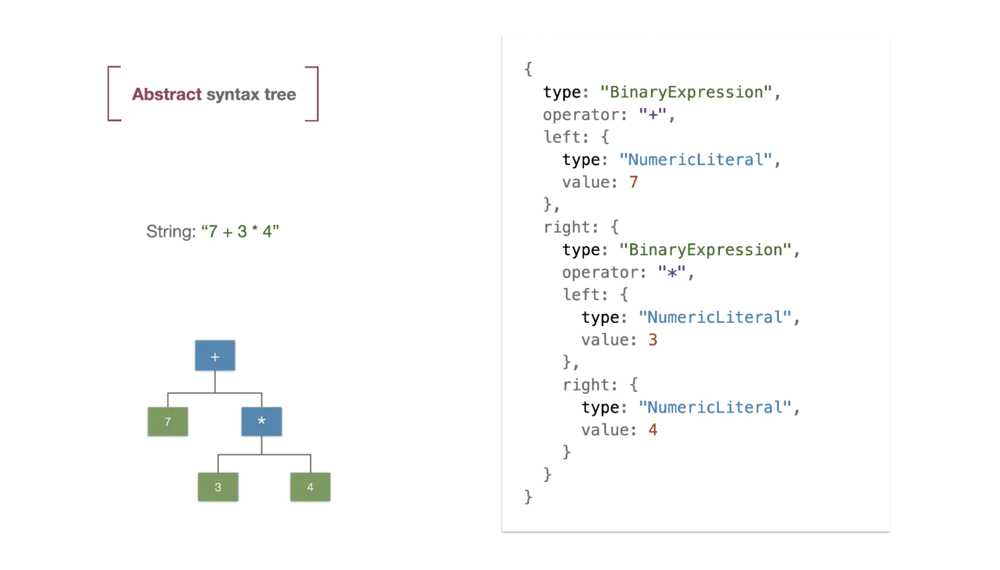

# Introducing `PizzaScript` - Writing Lexer with `Golang` and `RxGo`

- About us
- PizzaScript
  - Goals
  - Examples
- Theory
  - Programming Languages
  - Lexer, Parser
- Code Overview
- Summary
  - Next Steps

# About us

**XTechnology** - *Educational Programming and Data Science* open source project

## Goals

- learn new technologies
- share ideas and knowledge
- build online projects and community
- and have fun! 👋

Copyright (c) 2021 x-technology

## [🐦 AlexKorzhikov](https://twitter.com/AlexKorzhikov), [korzio](https://github.com/korzio), 13 of February 2021


👋 JavaScript, Golang, Java, DevOps @ING

## [Igor Smirnov](https://smithio.medium.com/)


👋 Data Science @Crayon

# PizzaScript


### Goals

- Understand how programming languages & interpreters work
- Learn `Go` language, and key libraries like `RxGo`
- Experiment with `WebAssembly`

### Key Features

- Cool name!
- `JavaScript` like syntax
- Variables, integers, floats and strings
- Arithmetic expressions, built-in functions
- Functions, first class functions, closures
- Dynamic types and coercions
- Modules & Standard library
- Compiles to `WebAssembly` and produces modules in `wasm` or `wat` formats

## Examples

The `PizzaScript` goal is to take everyone equally

```ps
5 + 5 * 10 // = 100
```

All operators should have same priority

```ps
var h1679 = "1"
val g2788 = 2

h1679 + g2788 == "12"
g2788 + h1679 == 3
```

In mathematics, commutative property means

> "changing the order of the operands does not change the result"

```ps
fun sum(var a1573: string, b7232): int {
  a1573 + b7232
}

sum(1, 2) // 12
```

`Kotlin` variables operators `var, val`

```ps
export "pizza/io/print"

a1573 = "1"
print a1573 // "1"
var a1573: string = "null"

print b2217 // undefined
val b2217: int = 34
```

Standard library, ported to `WebAssembly`

```ps
c6572 = 1
print c6572 // 1.0
c6572: float = 3
```

All variables are hoisted by default, and it is possible to switch it off

```json
{
  "Hoisting": "false"
}
```

# Programming Languages

- `Alphabet` all available symbols

- `Chains` of characters makes a text in `alphabet`

- A specific set of `chains` from the `alphabet` form a `language`

## How can we specify the language?

- `Grammars` are rules defining a language, a written in a special form algorithm.

The most known is [the `Backus–Naur` form](https://en.wikipedia.org/wiki/Backus%E2%80%93Naur_form)


```
expr ::= operand {('+' | '-' | '*' | '/') operand} 
operand ::= num [+/-] | '(' expr ')' 
num ::= digit {digit} ['.' {digit}]] 
digit ::= '0 | '1' | '2' | '3' | '4' | '5' | '6' | '7' | '8' | '9'
```

## What is described with the grammar above?

[Extended Example](https://github.com/antlr/grammars-v4/blob/master/calculator/calculator.g4)

```
G = ({S},{0, 1}, {S → 0S1, S → 01},S). L(G) ?

G = ({S, A},{0, 1}, {S → 0S, S → 0A, A → 1A, A → 1},S). L(G) ?
```

Or, a better way to define a language - write a compiler!

## Stages of a Compiler

- `Lexer` - split text into lexems or tokens

Tokens are of different types, such as data types - **numbers, strings**, variables definitions - **identifiers**, operators - **+, -, =, /**, etc.

Tokens for `a + b(c)`

```
NAME "a"
PLUS "+"
NAME "b"
LEFT_PAREN "("
NAME "c"
RIGHT_PAREN ")"
```

- `Parser` - works with tokens, checks language syntax and produces an *Abstract Syntax Tree* (ast).



`AST` - a data object, representing programm's text as a declarative tree structure. 

Check the [AST Explorer](https://astexplorer.net/)


- `Compile`, `Eval`, or `Interpret`. `PizzaScript` compiler will compile to `WebAssembly`, meaning we will produce an output in `wasm` or `wat` format.

> `Compiler` - a program that answers the question - if text is part of a language


## Code Review

- `Golang`
- [`RxGo`](https://github.com/ReactiveX/RxGo) implementation of `ReactiveX` - a common pattern for asyncronous data flow, including collections, iterators, operators
  - Unify API, data flow & interaction
  - [How to choose ReactiveX operator?](http://xgrommx.github.io/rx-book/content/which_operator_do_i_use/instance_operators.html)


- Output example

```
>> 1+2
{INT 1}
{+ +}
{INT 2}
>> 1+2 
{+ +}
{INT 1}
{INT 2}
>> 1+2
{INT 1}
{+ +}
{INT 2}
```

- Stages
  - Filter meaningless symbols
  - Reduce & Map combine symbols into tokens

- Operators overview (filter, map, create, reduce, ...)
- How to filter with order?

```go
DistinctUntilChanged(func(_ context.Context, i interface{}) (interface{}, error) {
  var str = i.(string)
  ch := []byte(str)[0]
  log.Info(str)

  return isNumber(ch), nil
})
```

```bash
>> 11-00
distinct:  1
distinct:  11
distinct:  11-
map:  11-
map:  11-
distinct:  11-0
map:  11-0
{INT 11-}
distinct:  11-00
{INT 11-}
{INT 11-0}
>> 11-00
distinct:  1
distinct:  11
distinct:  11-
map:  11-
map:  11-
{INT 11-}
{INT 11-}
distinct:  11-0
distinct:  11-00
map:  11-00
{INT 11-00}
```

- Scan operator


# Next Steps

- Change all lists to reactive collections
- Add tests, configure github CI

## Feedback
 
- [What should be our next topic for PizzaScript?](https://docs.google.com/forms/d/1LUIMYOHdxtG1JVbWTh57E3iPH3FmqLiJbyM5esmzOxc/edit)
  - WebAssembly - try a compile target, explain WebAssembly basics
  - Programming languages - extending PizzaScript and the interpreter
  - More on Golang? 
  - More on ReactiveX operators?

- Where do we go from here?

# Summary

- First implement lexer & calculator algorithm
- Use appropiate tools 🤔?!
- Learn `Go` specifics and `RxGo` operators
- Lots of material available

## Links

- [Pratt Parsing - Jonathan Apodaca](https://dev.to/jrop/pratt-parsing)

- [Language Study - Pixel](http://rigaux.org/language-study/syntax-across-languages/Mthmt.html)

- [Computer Languages History](https://www.levenez.com/lang/)

- [Parsing Algorithms. Formal grammars, context-free - Dmitry Soshnikov](https://www.youtube.com/watch?v=VZ5DJopq5JA)

- [Let’s Build A Simple Interpreter - Ruslan Spivak](https://ruslanspivak.com/lsbasi-part7/)

- [Writing An Interpreter In Go - Thorsten Ball](https://interpreterbook.com/)

## Join us 27th of February, 2021

- [🐦AlexKorzhikov](https://twitter.com/AlexKorzhikov), [korzio](https://github.com/korzio)

- [Igor Smirnov](https://smithio.medium.com/)

13 of February 2021

Copyright (c) 2021 x-technology
